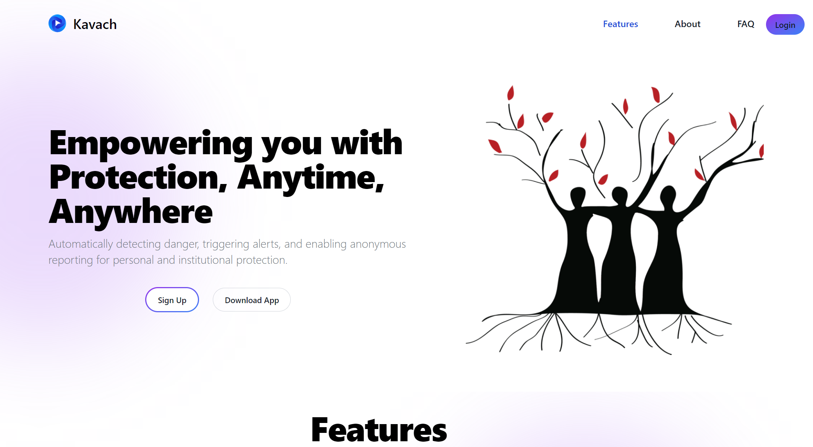

# 📱 Kawach: Empowering Safety Through Technology

**Kawach** is a comprehensive Android application crafted to prioritize the safety and empowerment of women. With a range of cutting-edge features, it serves as a multi-functional tool addressing the urgent need for secure spaces while enabling users to act with confidence.

## 🚀 Key Features

### 1. 🕵️ Anonymous Reporting
Many individuals—especially women—often hesitate to report harassment due to fear of retaliation. Kawach enables anonymous complaint registration within institutions such as colleges, schools, and IT sectors through its integrated **WebApp**, a core part of the Android app.

### 2. 🆘 SOS Alert System
When seconds matter, the **SOS feature** allows users to instantly send their live GPS location via SMS to selected emergency contacts. This works even **without internet access**, helping ensure swift responses in critical situations.

### 3. 📞 Emergency Helpline Integration
Manually dialing helpline numbers during emergencies can be stressful. Kawach’s one-tap **Auto-Call** function ensures instant connection with verified emergency helplines—saving time when it’s most needed.

### 4. 📷 Hidden Camera & Microphone Detection
Our unique **magnetometer-based detection system** acts as your invisible shield. By monitoring variations in magnetic fields, Kawach can detect hidden electronic devices—offering users protection from covert surveillance.

### 5. 🔗 Blockchain-Based Complaint System
Kawach uses the **Avalanche Blockchain** to log complaints, guaranteeing **tamper-proof**, decentralized, and immutable records. No complaint can be altered or deleted, reinforcing transparency and trust in the reporting process.

---

## 🖼️ Adding Images in README


You can include images in your `README.md` using the following Markdown syntax:

```markdown

